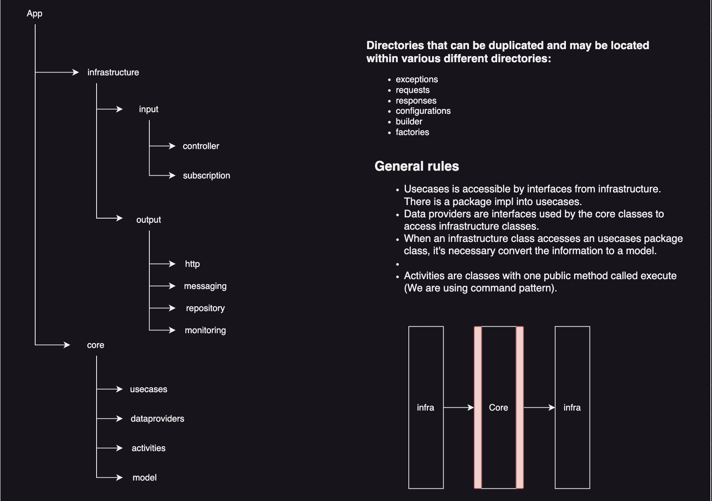

# Adding Prices of a Product

Adding prices of a product and calculating the inflation during a period by product, product type and region

## Clean Arch Example

This code was based in clean arch principles, dividing the code between infrastructure and non-infrastructure(into core package) classes.

## Micronaut 4.1.2 Documentation

- [User Guide](https://docs.micronaut.io/4.1.2/guide/index.html)
- [API Reference](https://docs.micronaut.io/4.1.2/api/index.html)
- [Configuration Reference](https://docs.micronaut.io/4.1.2/guide/configurationreference.html)
- [Micronaut Guides](https://guides.micronaut.io/index.html)
---

- [Shadow Gradle Plugin](https://plugins.gradle.org/plugin/com.github.johnrengelman.shadow)
- [Micronaut Gradle Plugin documentation](https://micronaut-projects.github.io/micronaut-gradle-plugin/latest/)
- [GraalVM Gradle Plugin documentation](https://graalvm.github.io/native-build-tools/latest/gradle-plugin.html)
## Feature data-mongodb documentation

- [Micronaut Data MongoDB documentation](https://micronaut-projects.github.io/micronaut-data/latest/guide/#mongo)

- [https://docs.mongodb.com](https://docs.mongodb.com)

## Feature serialization-jackson documentation

- [Micronaut Serialization Jackson Core documentation](https://micronaut-projects.github.io/micronaut-serialization/latest/guide/)

## Feature openapi documentation

- [Micronaut OpenAPI Support documentation](https://micronaut-projects.github.io/micronaut-openapi/latest/guide/index.html)

- [https://www.openapis.org](https://www.openapis.org)

## Feature mockito documentation

- [https://site.mockito.org](https://site.mockito.org)

## Feature micronaut-aot documentation

- [Micronaut AOT documentation](https://micronaut-projects.github.io/micronaut-aot/latest/guide/)

## Feature lombok documentation

- [Micronaut Project Lombok documentation](https://docs.micronaut.io/latest/guide/index.html#lombok)

- [https://projectlombok.org/features/all](https://projectlombok.org/features/all)

## Feature swagger-ui documentation

- [Micronaut Swagger UI documentation](https://micronaut-projects.github.io/micronaut-openapi/latest/guide/index.html)

- [https://swagger.io/tools/swagger-ui/](https://swagger.io/tools/swagger-ui/)

## Feature test-resources documentation

- [Micronaut Test Resources documentation](https://micronaut-projects.github.io/micronaut-test-resources/latest/guide/)

